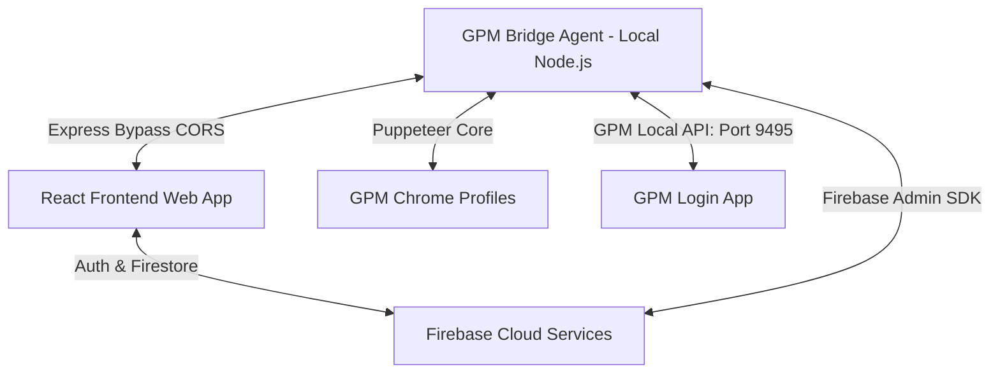

# 📊 FB Pulse Tracker

**FB Pulse Tracker** là một nền tảng quản trị và phân tích dữ liệu Facebook nội bộ kết hợp với hệ thống **Seeding Manager** tự động hóa thông qua công cụ **GPM Login**. Hệ thống được thiết kế theo mô hình MVP (Minimum Viable Product) để phục vụ cho các chiến dịch seeding và phân tích hiệu quả tương tác một cách tối ưu và an toàn.

---

## 🏗️ Kiến Trúc Hệ Thống

Dự án được xây dựng dựa trên mô hình Client-Agent kết nối qua Firebase Cloud:



1. **Frontend Web App (Thư mục gốc)**: 
   - Sử dụng React 19, Vite, TypeScript, Ant Design (v6) và ECharts.
   - Kết nối trực tiếp đến Firebase Client SDK (Auth, Firestore).
   - Cho phép import dữ liệu Facebook ZIP, xem dashboard, biểu đồ phân tích cảm xúc (Sentiment) & ý định (Intent) từ AI, và lên lịch seeding.
2. **GPM Bridge Agent (Thư mục `/gpm-bridge`)**:
   - Sử dụng Node.js, Express, Puppeteer Core và Firebase Admin SDK.
   - Đóng vai trò là tác nhân chạy ngầm (agent) tại máy local của kỹ thuật viên.
   - Cung cấp HTTP API Server (port `3001`) làm cầu nối giúp Frontend giao tiếp trực tiếp với GPM Login API nội bộ (mặc định port `9495`), loại bỏ hoàn toàn rào cản CORS.
   - Lắng nghe realtime các seeding task trạng thái `pending` từ Firestore, tự động khởi chạy profile Chrome tương ứng của GPM, sử dụng Puppeteer để thực hiện seeding tự động (comment, reaction) và cập nhật trạng thái lên Firestore.

---

## ✨ Các Tính Năng Core (MVP)

### 1. Phân Quyền & Quản Trị Whitelist (Internal Auth Only)
* **Không Đăng Ký Công Khai**: Đăng nhập bằng Email/Password Firebase. Không hỗ trợ đăng ký công khai hay liên kết mạng xã hội để bảo mật dữ liệu.
* **Cơ Chế Whitelist (`allowedAccounts`)**: Chỉ những tài khoản có ID được thêm trước vào Firestore collection `allowedAccounts` mới có quyền truy cập. User lạ đăng nhập sẽ bị tự động đăng xuất và thông báo liên hệ Admin.
* **Hai Phân Quyền Chính**:
  - **Viewer (role = 0)**: Chỉ xem Dashboard, Imports, Comments, Analytics, Seeding Dashboard & Reports. Không có nút thao tác ghi (Import, Xóa, Tạo seeding, v.v.).
  - **Admin (role = 1)**: Toàn quyền CRUD dữ liệu, quản lý whitelist, tạo tài khoản member nội bộ (tự động thêm vào whitelist và Firebase Auth), tạo chiến dịch/nhiệm vụ seeding. Luật Firestore cấm Admin tự xóa hoặc hạ quyền của chính mình để tránh mất quyền quản trị gốc.

### 2. Quản Lý & Phân Tích Dữ Liệu Facebook ZIP
* **Import Facebook ZIP**: Tải trực tiếp file ZIP xuất ra từ Facebook (Comments & Reactions) lên hệ thống.
* **Bộ Lọc Phân Tích Thông Minh**: Phân loại comment theo cảm xúc (Sentiment: Tích cực, Tiêu cực, Trung lập) và ý định (AI Intent) bằng mô hình AI Gemini. Fallback nội bộ sẽ tự động kích hoạt nếu API Gemini lỗi để đảm bảo luồng công việc không bị gián đoạn.
* **Xuất Dữ Liệu**: Hỗ trợ export dữ liệu đã phân tích ra các định dạng CSV, JSON và Microsoft Excel (XLSX).

### 3. Module Seeding Manager & Tích Hợp GPM Login
* **Quản Lý Profiles GPM**: Đồng bộ danh sách tài khoản GPM Login cục bộ lên Firestore. Xem chi tiết thông số profile (Browser, OS, Proxy, Group) và điều khiển mở/đóng profile trực tiếp từ giao diện web.
* **Tự Động Hóa Seeding Task**:
  - Khi một task seeding được chuyển sang trạng thái `pending`, **GPM Bridge Agent** sẽ tự động khóa task (`running`), gọi GPM mở profile Chrome thích hợp.
  - Kết nối Puppeteer để tự động đi đến link bài viết, thực hiện viết bình luận hoặc thả tim/like theo nội dung được yêu cầu.
  - Cập nhật trạng thái thành công (`success`) hoặc tự động thử lại (`retry` tối đa 3 lần sau mỗi 10 giây nếu có lỗi) lên Firestore.
* **AI Planner**: Hỗ trợ Admin lập kế hoạch kịch bản seeding tự động từ Prompt. AI sẽ tự động phân tích mục tiêu, sinh ra nội dung seeding, đề xuất khoảng nghỉ (delay) an toàn để tránh bị Facebook quét spam.
* **Chiến Dịch Hẹn Giờ (Scheduled Campaigns)**: Cho phép lên lịch chạy seeding vào khung giờ vàng. Bridge Agent sẽ tự động quét định kỳ mỗi 30 giây để kích hoạt chiến dịch đến hạn.

---

## 🚀 Hướng Dẫn Cài Đặt & Khởi Chạy

### 1. Chuẩn Bị File Cấu Hình Firebase Service Account
Để **GPM Bridge Agent** có thể lắng nghe task và đồng bộ profile với Firestore, bạn cần tạo file cấu hình admin:
1. Vào Firebase Console -> Project Settings -> Service Accounts.
2. Nhấp chọn **Generate new private key** (Tạo khóa riêng tư mới) và tải file `.json` về.
3. Đổi tên file thành `firebase-service-account.json` và lưu vào thư mục gốc của dự án `/` (hoặc trong thư mục `/gpm-bridge` tùy vào biến môi trường cấu hình).

### 2. Cài Đặt Frontend Web App (Thư mục gốc)

1. Tạo file `.env` từ file mẫu:
   ```bash
   cp .env.example .env
   ```
2. Cập nhật các thông số cấu hình Firebase và Gemini API Key trong file `.env`:
   ```env
   VITE_FIREBASE_API_KEY=your_api_key
   VITE_FIREBASE_AUTH_DOMAIN=your_auth_domain
   VITE_FIREBASE_PROJECT_ID=your_project_id
   VITE_FIREBASE_STORAGE_BUCKET=your_storage_bucket
   VITE_FIREBASE_MESSAGING_SENDER_ID=your_sender_id
   VITE_FIREBASE_APP_ID=your_app_id
   VITE_GEMINI_API_KEY=your_gemini_key
   VITE_GEMINI_MODEL=gemini-2.0-flash
   ```
3. Cài đặt các thư viện dependencies và chạy máy chủ phát triển (Vite Dev Server):
   ```bash
   npm install
   npm run dev
   ```

Chay nen Bridge khong can mo terminal:
```bash
npm run bridge:start-bg
```

Cai Bridge tu chay khi dang nhap Windows:
```bash
npm run bridge:install-startup
```

Sau khi cai startup task, mo `http://localhost:3001/health` de kiem tra. Neu `gpm.ok=true`, Bridge da san sang va se tu mo GPM Login nen khi can.
   *Frontend sẽ chạy tại địa chỉ: [http://localhost:5173](http://localhost:5173)*

### 3. Cài Đặt GPM Bridge Agent (Thư mục `/gpm-bridge`)

1. Di chuyển vào thư mục `/gpm-bridge` và sao chép cấu hình môi trường:
   ```bash
   cd gpm-bridge
   cp .env.example .env
   ```
2. Cập nhật các biến trong file `/gpm-bridge/.env`:
   ```env
   # API GPM Login chạy ở local máy bạn (mặc định GPM chạy port 9495 hoặc 3000)
   GPM_API_URL=http://127.0.0.1:9495

   # Bridge có thể tự khởi động GPM Login nền nếu API chưa sẵn sàng.
   # Nếu để trống, bridge sẽ tự dò các đường dẫn phổ biến trong AppData / Program Files.
   GPM_EXECUTABLE_PATH=C:\Users\Acer\AppData\Local\Programs\GPMLoginGlobal\GPMLoginGlobal.exe
   GPM_HTTP_PORT_FILE=
   GPM_AUTO_START=true
   GPM_AUTO_START_ON_BRIDGE_START=true
   GPM_STARTUP_TIMEOUT_MS=45000
   GPM_STARTUP_POLL_INTERVAL_MS=1500
   GPM_STARTUP_ARGS=
   
   # Đường dẫn tới file credentials Firebase Admin SDK đã tải ở Bước 1
   FIREBASE_SERVICE_ACCOUNT_PATH=../firebase-service-account.json
   
   # Thời gian delay ngẫu nhiên giữa các hành động seeding trên trình duyệt (giảm thiểu quét spam)
   MIN_DELAY_SECONDS=5
   MAX_DELAY_SECONDS=20
   
   # Port chạy HTTP API của Bridge Agent
   API_SERVER_PORT=3001
   ```
3. Cài đặt dependencies và chạy ở chế độ dev:
   ```bash
   npm install
   npm run dev
   ```
   *Bridge Agent sẽ chạy tại địa chỉ: [http://localhost:3001](http://localhost:3001)*

> Lưu ý: GPM Login không cần mở thủ công trước, nhưng process GPM vẫn phải được bridge khởi động nền thành công để Local API hoạt động.

---

## 🔑 Thiết Lập Admin Đầu Tiên (Bootstrap Admin)

Vì hệ thống không hỗ trợ đăng ký tài khoản tự do, tài khoản Admin đầu tiên bắt buộc phải khởi tạo thủ công:

1. Vào **Firebase Console** -> **Authentication**, bật nhà cung cấp đăng nhập **Email/Password**.
2. Nhấp chọn **Add user**, nhập Email và Password, sau đó nhấn Save. Copy lại chuỗi **User UID** của tài khoản vừa tạo.
3. Chuyển sang **Firestore Database**, tạo một collection mới có tên là `allowedAccounts`.
4. Tạo một tài liệu (document) mới trong collection đó với:
   - **Document ID**: Dán chuỗi **User UID** vừa copy ở trên vào.
   - Các trường dữ liệu (fields):
     ```text
     email: admin@company.com (string)
     displayName: Super Admin (string)
     role: 1 (number)
     ```
5. Deploy luật bảo mật Firestore Rules lên Firebase:
   ```bash
   firebase deploy --only firestore:rules
   ```
6. Đăng nhập vào trang web `/login` bằng tài khoản Admin này. Lúc này bạn có thể vào trang **Admin** để trực tiếp tạo thêm các tài khoản Viewer hoặc Admin khác một cách dễ dàng mà không cần thao tác thủ công trên console nữa.

---

## 🛡️ Kiểm Tra Chất Lượng Code & Kiểm Thử (QA Checklist)

Trước khi đóng gói hoặc bàn giao dự án lên môi trường Staging/Production, bạn bắt buộc phải kiểm tra qua các bước sau để đảm bảo chất lượng:

```bash
# 1. Kiểm tra cú pháp và chất lượng mã nguồn (Linter)
npm run lint

# 2. Chạy toàn bộ 291 bài test Unit Test cốt lõi
npm test -- --runInBand

# 3. Biên dịch thử nghiệm Frontend React
npm run build

# 4. Chạy kiểm thử tự động End-to-End với Playwright (nếu có cấu hình)
npm run test:e2e

# 5. Build mã nguồn Cloud Functions (nếu dùng)
npm --prefix functions run build

# 6. Biên dịch TypeScript cho GPM Bridge Agent
npm --prefix gpm-bridge run build
```

---

## 📂 Tài Liệu Tham Khảo Thêm

Hệ thống có sẵn các tài liệu hướng dẫn vận hành chi tiết đặt tại thư mục `/docs` hoặc file báo cáo định kỳ:
* **Chi tiết kiểm thử QA**: [BAO_CAO_ANTIGRAVITY_QA_2026-06-14T1614.md](BAO_CAO_ANTIGRAVITY_QA_2026-06-14T1614.md)
* **Báo cáo Module GPM Profiles**: [BAO_CAO_GPM_PROFILES_MODULE_2026-06-14.md](BAO_CAO_GPM_PROFILES_MODULE_2026-06-14.md)
* **Tài liệu thiết kế gốc**: [DESIGN.md](DESIGN.md)
* **Hướng dẫn vận hành Seeding**: [docs/SEEDING_MANAGER_GUIDE.md](docs/SEEDING_MANAGER_GUIDE.md)
* **Sổ tay kết nối Excel/CSV Bridge**: [docs/GPM_EXCEL_BRIDGE.md](docs/GPM_EXCEL_BRIDGE.md)
* **Danh mục kiểm thử nội bộ**: [docs/MVP_INTERNAL_CHECKLIST.md](docs/MVP_INTERNAL_CHECKLIST.md)
